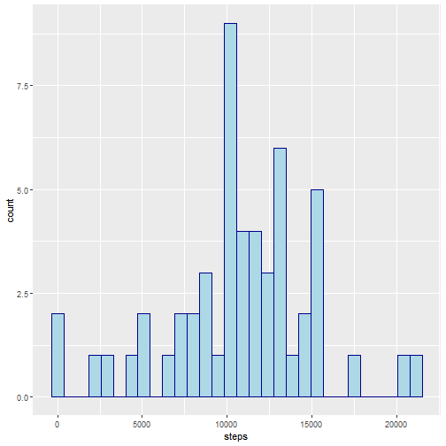
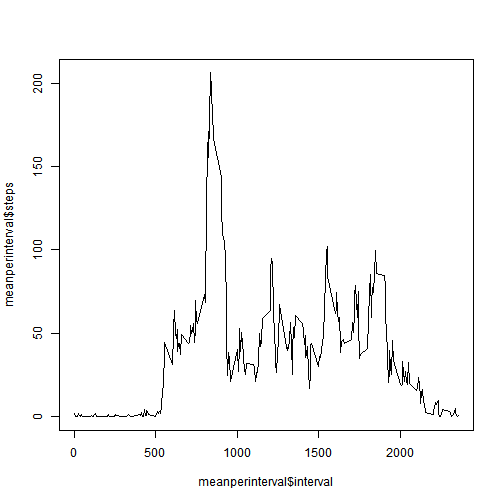
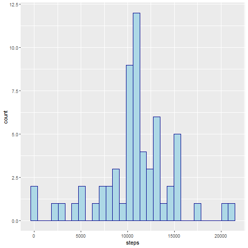
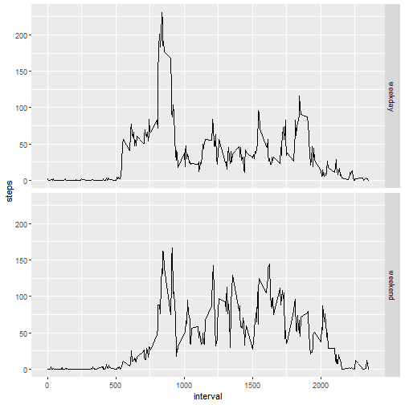

## Introduction

It is now possible to collect a large amount of data about personal movement using activity monitoring devices. These type of devices are part of the “quantified self” movement – a group of enthusiasts who take measurements about themselves regularly to improve their health, to find patterns in their behavior, or because they are tech geeks. But these data remain under-utilized both because the raw data are hard to obtain and there is a lack of statistical methods and software for processing and interpreting the data.  
  
In this report, we will make use of data from a personal activity monitoring device to get insights from it. This device collects data at 5 minute intervals through out the day. The data consists of two months of data from an anonymous individual collected during the months of October and November, 2012 and include the number of steps taken in 5 minute intervals each day.  
  
The data used for this study can be downloaded here: [Activity Monitoring Data](https://d396qusza40orc.cloudfront.net/repdata%2Fdata%2Factivity.zip).  
The variables included in this data set are:  
- **steps**: Number of steps taking in a 5-minute interval (missing values are coded as NA)  
- **date**: The date on which the measurement was taken in YYYY-MM-DD format  
- **interval**:  Identifier for the 5-minute interval in which measurement was taken  
  
The dataset is stored in a comma-separated-value (CSV) file and there are a total of 17,568 observations in this dataset.  

## Loading and preprocessing the data  
  
The first part of our analysis consist on loading the data into R and adapt it to our major purposes, here we unzipped it and we read it making its class *data.frame* and naming it *activity*, then we convert the date column of *activity* from character to POSIXct and create a new column with the weekday of the measurement.  
  
  To make this part is neccesary to have the zip in the working directory.  


```r
unzip("activity.zip")
activity <- read.csv("activity.csv")
activity$date <- as.POSIXct(activity$date, format="%Y-%m-%d")
weekday <- weekdays(activity$date)
activity <- cbind(activity, weekday)
```
Let's see how the data frame looks like:  

```r
head(activity)
```

```
##   steps       date interval weekday
## 1    NA 2012-10-01        0   lunes
## 2    NA 2012-10-01        5   lunes
## 3    NA 2012-10-01       10   lunes
## 4    NA 2012-10-01       15   lunes
## 5    NA 2012-10-01       20   lunes
## 6    NA 2012-10-01       25   lunes
```

## What is the mean of total steps taken per day?

For this part of the assignment, we can ignore the NA values of *steps*  
  
First we will subset the rows that don't have NA values, then we will make a data frame showing the total number of steps per day and we'll make a histogram with this data.   

```r
stepswithoutNA <- activity[!(is.na(activity$steps)), ]
sumperday <- aggregate(steps ~ date, stepswithoutNA, sum)
library(ggplot2)
g <- ggplot(sumperday, aes(x=steps))+geom_histogram(color="darkblue", fill="lightblue")
print(g)
```

```
## `stat_bin()` using `bins = 30`. Pick better value with `binwidth`.
```


  
Finally, let's calculate the mean and median of the daily steps:  

```r
mean(sumperday$steps)
```

```
## [1] 10766.19
```

```r
median(sumperday$steps)
```

```
## [1] 10765
```
  
## What is the average daily activity pattern?
  
To answer this question we'll make use of time series.  
We calculate the mean per interval and plot the time series.  

```r
meanperinterval <- aggregate(steps ~ interval, activity, mean)
plot(meanperinterval$interval, meanperinterval$steps, type="l")
```


  
For this question, we need to obtain the Interval in which the maximum average steps value ocured, let's calculate it:  

```r
max(meanperinterval$steps)
```

```
## [1] 206.1698
```

```r
# With this, we now know the maximum is more than 206
meanperinterval[meanperinterval$steps > 206, ]
```

```
##     interval    steps
## 104      835 206.1698
```
  
We can see that the 5-minute interval that on average across all the days in the dataset, contains the maximum number of steps is the 835th.  

## Imputing missing values

For this part, we first need to calculate the number of rows in which there are NA values of *steps*  
  

```r
stepswithNA <- activity[(is.na(activity$steps)), ]
dim(stepswithNA)
```

```
## [1] 2304    4
```
  
There are 2304 rows with NA values for *steps*  
  
Now we'll fill the NA rows with the mean of the corresponding 5 minute average observation. 
But first, let's see what the first values of *steps* are originally:  

```r
head(activity)
```

```
##   steps       date interval weekday
## 1    NA 2012-10-01        0   lunes
## 2    NA 2012-10-01        5   lunes
## 3    NA 2012-10-01       10   lunes
## 4    NA 2012-10-01       15   lunes
## 5    NA 2012-10-01       20   lunes
## 6    NA 2012-10-01       25   lunes
```
  
We can see that minimum, the first five values of steps, are NA... now, with the mutate function:  
  

```r
library(dplyr)
filledactivity <- mutate(group_by(activity, interval), steps=replace(steps, is.na(steps), mean(steps, na.rm=TRUE)))
head(filledactivity)
```

```
## # A tibble: 6 x 4
## # Groups:   interval [6]
##    steps date                interval weekday
##    <dbl> <dttm>                 <int> <chr>  
## 1 1.72   2012-10-01 00:00:00        0 lunes  
## 2 0.340  2012-10-01 00:00:00        5 lunes  
## 3 0.132  2012-10-01 00:00:00       10 lunes  
## 4 0.151  2012-10-01 00:00:00       15 lunes  
## 5 0.0755 2012-10-01 00:00:00       20 lunes  
## 6 2.09   2012-10-01 00:00:00       25 lunes
```
  
Voila! The NA values are now replaced by the average of the corresponding 5 minute interval.  
Let's make a histogram just like the one we created at the beginning, but now with the NA values replaced with the mean value we just refered above  
  

```r
filledsumperday <- aggregate(steps~date, filledactivity, sum)
g <- ggplot(filledsumperday, aes(x=steps))+geom_histogram(color="darkblue", fill="lightblue")
print(g)
```

```
## `stat_bin()` using `bins = 30`. Pick better value with `binwidth`.
```


  
By a first look, we can see that the frequency of some sections grow, but, are mean and median values gonna change?  
  

```r
mean(filledsumperday$steps)
```

```
## [1] 10766.19
```

```r
median(filledsumperday$steps)
```

```
## [1] 10766.19
```
  
We can see that the value of the mean doesn't changed and the value of the median changed almost nothing.  
  
## Are there differences in activity patterns between weekdays and weekends?
  
For this part we'll make use of the *filledactivity* data frame.  
  
With the unique function, we can see that there are seven different values for weekday  
  

```r
unique(filledactivity$weekday)
```

```
## [1] "lunes"     "martes"    "miércoles" "jueves"    "viernes"   "sábado"    "domingo"
```
  
Being *sábado* and *domingo* the values needed for weekend
  

```r
filledactivity$typeofday <- sapply(filledactivity$date, function(x){
  if(weekdays(x)=="sábado" | weekdays(x)=="domingo"){y <- "weekend"}
  else {y <- "weekday"}
  y
})
head(filledactivity)
```

```
## # A tibble: 6 x 5
## # Groups:   interval [6]
##    steps date                interval weekday typeofday
##    <dbl> <dttm>                 <int> <chr>   <chr>    
## 1 1.72   2012-10-01 00:00:00        0 lunes   weekday  
## 2 0.340  2012-10-01 00:00:00        5 lunes   weekday  
## 3 0.132  2012-10-01 00:00:00       10 lunes   weekday  
## 4 0.151  2012-10-01 00:00:00       15 lunes   weekday  
## 5 0.0755 2012-10-01 00:00:00       20 lunes   weekday  
## 6 2.09   2012-10-01 00:00:00       25 lunes   weekday
```
Now let's make a panel plot containing a time series plot of the 5-minute interval (x-axis) and the average number of steps taken, averaged across all weekday days or weekend days (y-axis).   
  

```r
meanperinterval3 <- aggregate(steps~interval + typeofday, filledactivity, mean)
g <- ggplot(meanperinterval3, aes(x=interval, y=steps, label=round(steps, 2)))+facet_grid(typeofday~.)+geom_line()
print(g)
```


  
We can clearly observe that during weekends, the average steps and maximum get reduced.
